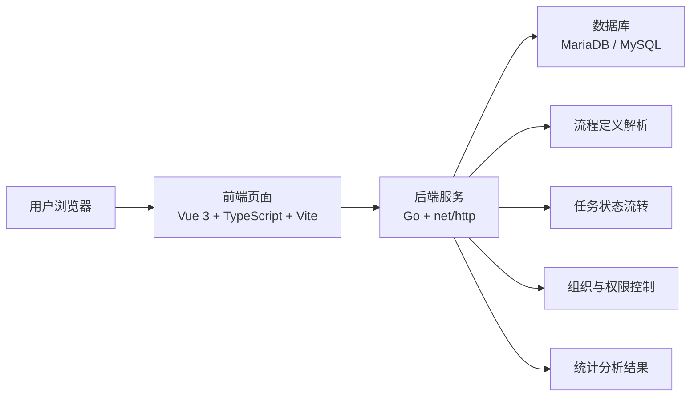
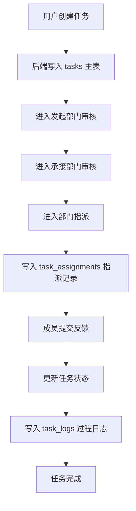
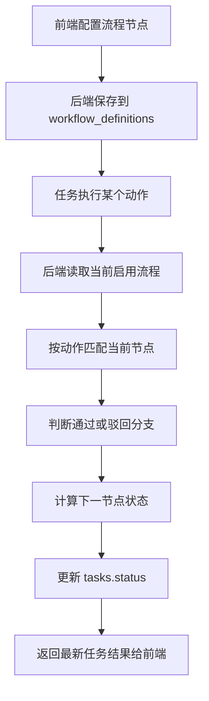

# NovaOffice OA 系统说明文档

## 1. 文档目的

本文档用于说明 NovaOffice OA 项目的整体工作方式、技术栈职责、核心后端实现思路，以及自定义业务流程的实现方式，适合用于项目汇报、交接和技术说明。

## 2. 架构图

### 2.1 系统整体架构图

这张图表达的是：

- 用户首先通过前端页面发起操作
- 前端将请求发送给 Go 后端
- 后端负责处理任务、流程、组织、权限和统计逻辑
- 后端最终通过数据库完成数据读写

### 2.2 核心业务流转图

这张图表达的是任务模块的主链路：

- 主任务状态保存在 `tasks`
- 执行人记录保存在 `task_assignments`
- 过程轨迹保存在 `task_logs`

### 2.3 自定义流程执行图

这张图表达的是：

- 流程先被配置成数据
- 后端在执行时解析流程节点
- 再根据节点关系推进任务状态

## 3. 系统整体是如何工作的

这套系统本质上是一个办公协同和流程任务系统，主要由三部分组成：

- 前端：负责页面展示和用户交互
- 后端：负责接口处理和业务逻辑执行
- 数据库：负责保存系统业务数据

系统工作链路如下：

1. 用户在浏览器中访问系统并进行操作，例如登录、创建任务、审核任务、查看组织架构或查看分析数据。
2. 前端将这些操作通过 HTTP 请求发送给后端接口。
3. 后端根据不同接口执行相应业务逻辑，例如校验用户、推进任务状态、查询组织数据、读取流程定义。
4. 后端将业务数据写入数据库，或者从数据库读取已有数据。
5. 后端将处理结果以 JSON 形式返回给前端。
6. 前端根据返回结果刷新页面，展示最新业务状态。

可以概括为：

> 前端负责交互，后端负责规则，数据库负责保存状态，三者配合完成整个协同流程。

## 4. 技术栈及职责

### 4.1 前端技术栈

- `Vue 3`
- `TypeScript`
- `Vite`
- `Tailwind CSS`
- `D3`
- `lucide-vue-next`

它们的职责如下：

- `Vue 3`：负责页面和组件开发，例如登录页、组织架构页、任务看板、流程设计页、数据分析页。
- `TypeScript`：负责为前端数据结构提供类型约束，保证任务、用户、部门、流程等数据在前端使用时更稳定。
- `Vite`：负责前端工程构建，将源码打包成生产环境可用的 `dist/` 静态资源。
- `Tailwind CSS`：负责页面布局与样式开发。
- `D3`：负责图形化和可视化展示，例如组织图、流程图和统计图表。
- `lucide-vue-next`：负责页面图标显示。

### 4.2 后端技术栈

- `Go`
- `net/http`
- `database/sql`
- `github.com/go-sql-driver/mysql`

它们的职责如下：

- `Go`：承担整个系统后端服务实现。
- `net/http`：负责启动 HTTP 服务、接收请求、分发请求、返回响应。
- `database/sql`：负责数据库连接管理、SQL 查询和 SQL 执行。
- `go-sql-driver/mysql`：负责将 Go 后端连接到 MySQL 或 MariaDB。

### 4.3 数据库

- `MariaDB / MySQL`

数据库负责保存系统中的核心业务数据，包括：

- 用户数据
- 部门数据
- 任务数据
- 指派记录
- 任务日志
- 审批数据
- 流程定义
- 系统设置

## 5. 后端是如何实现的

后端采用的是单体 Go 服务方式，没有引入复杂 Web 框架，而是直接使用 Go 标准库实现。

### 5.1 服务启动流程

后端启动后主要完成以下步骤：

1. 读取环境变量，例如端口号、数据库驱动、数据库连接信息。
2. 初始化 `App` 对象，保存数据库连接和系统运行所需上下文。
3. 建立数据库连接。
4. 自动检查并初始化数据库表结构。
5. 自动写入默认种子数据，例如默认部门、默认管理员、默认流程定义。
6. 注册 HTTP 请求入口。
7. 启动服务并监听端口。

在实现层面，后端服务会维护一个统一的 `App` 结构体，里面保存：

- 数据库连接对象
- 当前数据库驱动类型
- 数据库标识信息
- 前端静态资源目录

这样做的目的，是让接口处理函数都能共享同一套运行上下文，而不是在每个接口里重复建立连接或重复加载配置。

### 5.2 路由是如何实现的

路由的本质是“把不同请求分发给不同处理函数”。

在本项目中，后端先统一接收请求，然后按规则进行分发：

- 如果请求路径以 `/api/` 开头，进入接口处理逻辑。
- 如果不是 `/api/`，则返回前端页面或静态资源。

接口内部再继续根据：

- 请求方法，例如 `GET`、`POST`、`PATCH`、`DELETE`
- 请求路径，例如 `/api/login`、`/api/tasks`、`/api/org`

来决定调用哪个具体函数。

例如：

- `POST /api/login`：处理登录
- `GET /api/tasks`：查询任务列表
- `POST /api/tasks`：创建任务
- `POST /api/tasks/{id}/assign`：执行任务指派
- `GET /api/workflows`：读取流程定义

也就是说，路由负责把请求正确送到对应业务处理逻辑。

从技术实现上看，这套路由不是依赖框架注解或自动映射，而是通过两层判断完成：

1. 第一层按 URL 前缀区分接口请求和静态资源请求
2. 第二层按 HTTP 方法和路径进行手工分发

例如任务相关接口，后端会先截出 `/api/tasks/` 后面的路径，再把路径拆成：

- 任务 ID
- 动作名称

然后再判断具体是：

- 审核
- 指派
- 反馈
- 普通更新

这种方式虽然轻量，但对当前业务规模足够直接，也更容易控制每个业务动作的入口。

### 5.3 数据初始化方式

后端不是依赖独立 migration 工具，而是在启动时自动完成基础数据库初始化。

主要包括：

- 自动建表
- 自动兼容部分旧表结构
- 自动插入默认基础数据

默认数据通常包括：

- 默认组织部门
- 默认用户
- 默认审批示例数据
- 默认业务流程
- 默认系统设置

这样做的好处是新环境启动后可以快速进入可用状态。

数据库初始化时，后端会根据当前驱动类型分别生成建表 SQL：

- MySQL / MariaDB 使用 `VARCHAR`、`TEXT`、`LONGTEXT`、`AUTO_INCREMENT`
- SQLite 使用 `TEXT`、`INTEGER`、`AUTOINCREMENT`

也就是说，表结构初始化并不是一套 SQL 兼容所有数据库，而是由后端在启动时按驱动选择对应语句。

## 6. 数据库模型是如何设计的

这个项目的数据库建模围绕“组织协同”和“流程任务”展开，核心表包括：

- `users`
- `departments`
- `tasks`
- `task_assignments`
- `task_logs`
- `approvals`
- `app_settings`
- `workflow_definitions`

其中几个关键表的职责如下：

### 6.1 users

保存用户基础信息，包括：

- 用户 ID
- 姓名
- 角色
- 所属部门
- 头像
- 邮箱
- 密码

### 6.2 departments

保存部门基础信息，包括：

- 部门 ID
- 部门名称
- 负责人
- 父部门 ID
- 排序字段

部门关系不是单独建树表，而是通过 `parent_id` 构造层级关系。

### 6.3 tasks

保存任务主信息，包括：

- 任务 ID
- 标题
- 描述
- 来源部门
- 承接部门
- 当前状态
- 优先级
- 截止日期
- 来源审核人
- 承接审核人
- 创建时间
- 更新时间

### 6.4 task_assignments

保存任务执行层数据，包括：

- 指派记录 ID
- 关联任务 ID
- 执行人 ID
- 执行人姓名
- 执行状态
- 反馈文本
- 附件 JSON
- 完成时间

### 6.5 task_logs

保存任务过程日志，包括：

- 关联任务 ID
- 操作描述
- 操作时间
- 操作人

### 6.6 workflow_definitions

保存流程定义，包括：

- 流程唯一标识
- 流程名称
- 流程描述
- 节点 JSON
- 是否启用
- 更新时间
- 更新人

这个表是自定义流程实现的核心。

## 7. 复杂业务逻辑是如何实现的

这个项目最核心的复杂业务在任务模块。

### 7.1 任务为什么拆成三层结构

任务不是简单放在一张表里，而是拆成三层：

1. 任务主表  
   保存任务标题、描述、来源部门、承接部门、状态、优先级、截止时间等核心信息。

2. 指派记录表  
   保存任务被指派给谁、执行状态、反馈内容、附件、完成时间。

3. 任务日志表  
   保存任务过程中的每一次业务动作，例如谁提交、谁审核、谁指派、谁反馈。

这样设计的意义是：

- 主任务负责表达当前任务状态
- 指派记录负责表达执行层信息
- 日志负责表达过程轨迹

因此，前端拿到的任务数据不是一个单独字段集合，而是一整套包含执行记录和日志的完整业务对象。

从技术实现角度看，后端在查询一个任务详情时，并不是只查一张表，而是分三步：

1. 查询主任务信息
2. 查询该任务对应的所有指派记录
3. 查询该任务对应的所有日志记录

最后在服务端把它们组装成一个完整任务对象返回给前端。

也就是说，接口层返回的是聚合结果，而不是单表原样输出。

### 7.2 任务状态是如何推进的

任务业务并不是前端随意改状态，而是由后端统一控制状态推进。

典型流程包括：

1. 用户创建任务
2. 发起部门负责人审核
3. 承接部门负责人审核
4. 承接部门负责人指派成员
5. 成员提交反馈
6. 任务完成

后端在处理每个动作时，通常都会做三件事：

1. 校验当前操作是否合法  
   例如当前用户是否是对应部门负责人，是否有权限执行审核或指派。

2. 计算任务下一状态  
   例如审核通过后是否进入下一审核节点，或者是否进入待指派状态。

3. 更新数据库并写入日志  
   保存任务状态变化、审核人、执行人、反馈内容等信息。

因此，复杂业务不是由前端页面决定，而是由后端通过规则统一推进。

从代码逻辑上看，任务推进会涉及几类典型动作：

- 创建任务
- 发起部门审核
- 承接部门审核
- 指派成员
- 提交反馈

每个动作处理完成后，后端都会：

- 更新主任务状态
- 视情况插入或更新 `task_assignments`
- 插入一条 `task_logs`

这样做的结果是，系统既知道“任务现在是什么状态”，也知道“这个状态是怎么走过来的”。

### 7.3 权限控制如何实现

本项目的权限控制不是一个独立的大型权限框架，而是和业务动作绑定实现的。

主要角色包括：

- 管理员
- 部门负责人
- 普通成员

在执行审核和指派时，后端会判断：

- 当前用户是否为管理员
- 如果不是管理员，是否为目标部门负责人
- 当前任务所属部门是否和用户所在部门一致

所以权限控制的重点不是“页面能不能点”，而是“后端是否允许这次业务动作执行”。

从实现角度上看，后端主要按下面这套规则判断：

- 管理员可以处理所有部门任务
- 部门负责人只能处理自己部门范围内的审核和指派
- 普通成员只能处理分配给自己的执行反馈

这意味着权限控制是嵌在业务处理中完成的，而不是交给前端决定。

## 8. 自定义业务流程是如何实现的

自定义业务流程的核心思想是：

> 不把流程完全写死在代码里，而是把流程定义做成数据库中的配置数据。

### 8.1 流程定义的数据结构

系统中的一个业务流程，本质上是一组节点定义。

每个节点通常描述以下信息：

- 节点名称
- 对应动作
- 节点状态
- 下一节点
- 驳回节点

也就是说，一个流程实际是一张“节点关系图”。

从技术实现上看，每个节点除了显示信息外，还会保存两类关键关系：

- `NextNode`：正常通过时流向哪个节点
- `RejectNode`：驳回时流向哪个节点

后端真正关心的不是节点画得漂不漂亮，而是这些节点关系能否构成一条可执行状态链。

### 8.2 流程如何保存

当前端在流程设计页面中配置流程时，本质上是在编辑一组流程节点数据。

后端接收这些数据后，会将流程定义保存到数据库中，包括：

- 流程标识
- 流程名称
- 流程描述
- 节点 JSON 配置
- 是否启用
- 更新时间
- 更新人

流程节点本身通常以 JSON 形式整体保存到数据库，这样做的好处是：

- 结构灵活
- 节点数量可变
- 前端流程设计器和后端存储格式容易对齐

### 8.3 流程如何执行

当任务真正开始流转时，后端并不是根据写死的 if-else 全部控制，而是：

1. 读取当前启用的流程定义
2. 根据当前业务动作找到对应节点
3. 判断当前操作是通过还是驳回
4. 根据节点配置找到下一节点或驳回节点
5. 读取下一节点对应的状态
6. 更新任务当前状态

因此，流程的执行逻辑实际上是：

- 前端负责配置流程
- 后端负责解析流程
- 数据库负责保存流程定义和执行结果

从技术细节上说，后端会做两类匹配：

1. 按当前动作匹配节点  
   例如“审核”“指派”“反馈”

2. 按当前状态匹配节点  
   例如任务已经处于“待审核”“待指派”“执行中”

然后根据“通过”或“驳回”分支，计算出下一状态。

为了避免流程配置错误导致死循环，后端在解析节点链时还会做访问记录控制，防止节点反复跳回自己。

### 8.4 这种实现方式的价值

这样做的好处有三点：

1. 流程具备可调整能力  
   流程变化时，不需要所有逻辑都改写。

2. 业务扩展性更好  
   后续增加新的流程类型时，可以复用同一套执行思路。

3. 前后端职责清晰  
   前端负责设计流程，后端负责解释并执行流程。

## 9. 系统中几类核心业务是如何协作的

### 9.1 用户和组织

用户和组织数据由后端负责维护。

- 用户包含姓名、角色、邮箱、部门等信息
- 部门通过父子关系构成组织树

数据库中部门通常以平面方式保存，后端查询后再组装成树结构返回前端展示。

从技术实现上看，部门树不是数据库直接返回的，而是后端先查出平面部门列表，再按 `parent_id` 在内存中组装为树结构。

### 9.2 任务与审批

任务是主业务对象，审批是辅助业务对象。

任务强调的是：

- 流程推进
- 指派执行
- 反馈闭环

审批强调的是：

- 单据状态变化
- 审批通过或驳回

### 9.3 数据分析

数据分析模块会基于现有业务数据进行统计汇总，例如：

- 任务总量
- 已完成任务数
- 待处理任务数
- 部门任务负载
- 员工工作量
- 近 7 天趋势

也就是说，分析模块不是独立业务系统，而是建立在已有任务、审批和组织数据之上的统计视图。

从技术实现上看，分析数据不是预先算好缓存起来，而是后端在请求时通过 SQL 实时统计后返回。

这意味着当前实现更偏轻量和直接，优点是实现简单，缺点是在数据量特别大时需要再做性能优化。

## 10. 总结

NovaOffice OA 这套系统的核心工作方式可以总结为：

- 前端负责交互和可视化展示
- 后端负责业务规则、流程推进和接口处理
- 数据库负责保存系统状态和流程定义

它的技术实现重点不在于引入非常重的框架，而在于把：

- 用户
- 部门
- 任务
- 审批
- 流程

这些业务对象之间的关系真正串起来，并通过后端统一控制状态流转，从而形成完整的协同闭环。

对于自定义流程部分，项目采用的是“配置驱动流程”的实现方式，把流程定义从代码中抽离出来，做成数据库中的节点配置，再由后端在执行阶段进行解释和推进，这也是本项目在业务设计上的一个关键实现点。
